# pyshp-latihan1
Ini merupakan kumpulan gambar dari soal 1-10 untuk memenuhi tugas Sistem Informasi Geografis menggunakan library pyshp serta QGIS.\
Tugas ini dibuat dengan mengandalkan [dokumentasi](https://pypi.org/project/pyshp/ "dokumentasi") dan tools sebagai berikut:
- Python v3.10.0
- QGIS v3.16.12
- pyshp v2.1.3

## Screenshot Latihan 2 soal 1 s/d 11
------------

### Soal 1

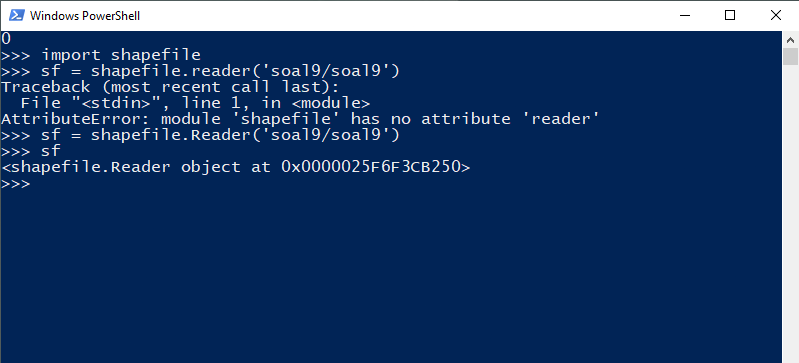

### Soal 2

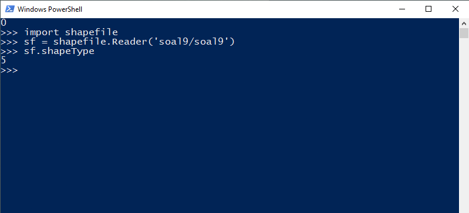

### Soal 3

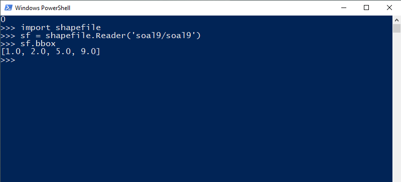

### Soal 4

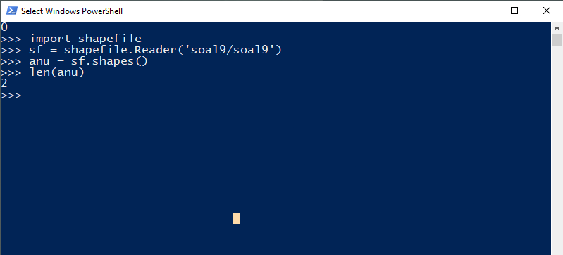

### Soal 5

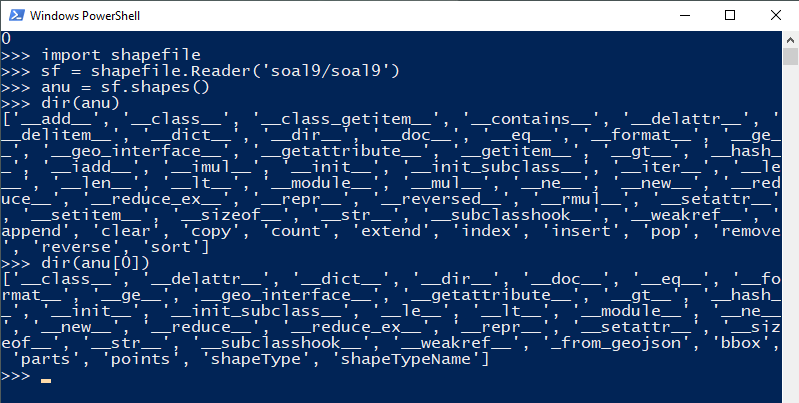

### Soal 6

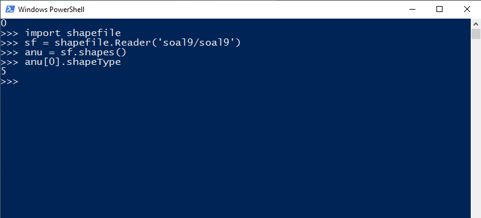

### Soal 7

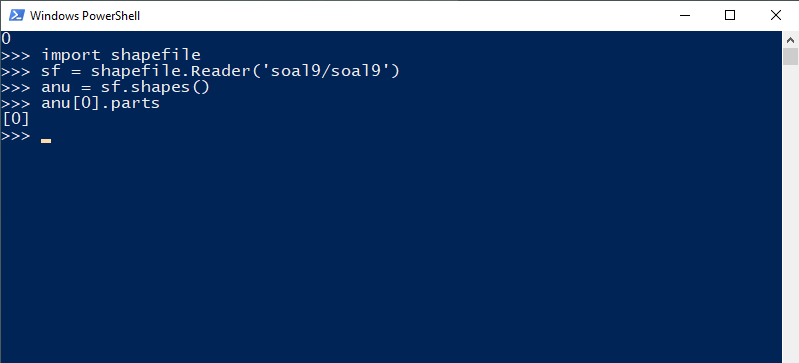

### Soal 8

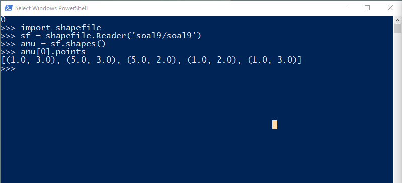

### Soal 9

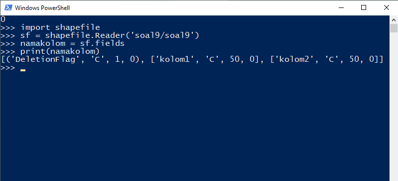

### Soal 10

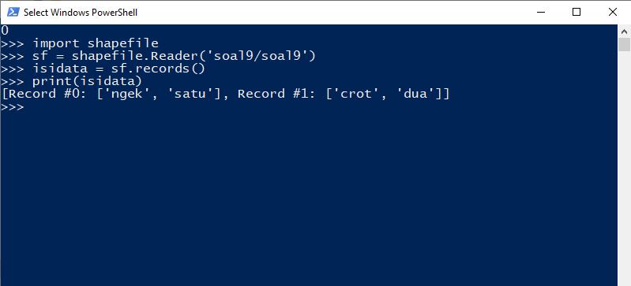

### Soal 11

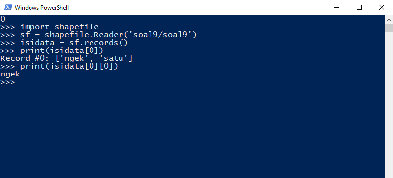

## Screenshot Latihan 1 soal 1 s/d 10
------------

### Soal 1

### Soal 2

Pada soal no. 2 telah ditambahkan shapetypenya adalah point. Shapetype tersebut dijadikan parameter pada method Writer().

### Soal 3

Soal no.3 digambarkan sebagai line karena pada line 5 terdapat re-assign shapeType menjadi polyline(3).

### Soal 4

Shapetype pada soal no.4 merupakan pointm. 'M' pada pointm merupakan measurement(ukuran).

### Soal 5

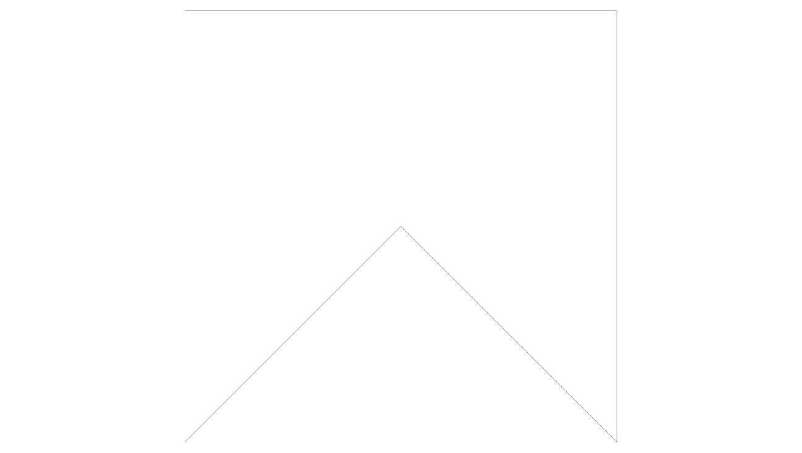

### Soal 6

### Soal 7

Karena koordinat awal dan akhir pada soal no.7 tidak sama, maka ini merupakan polyline. Oleh karena itu shapetypenya saya ubah menjadi polyline dan w.poly diubah menjadi w.line.

### Soal 8

### Soal 9

### Soal 10

1194055 % 8 = 7\
Dengan demikian, saya harus membuat segitiga siku-siku. Segitiga siku-siku tersebut harus ada 5 buah karena angka kedua terakhir dari NPM saya adalah 5.

